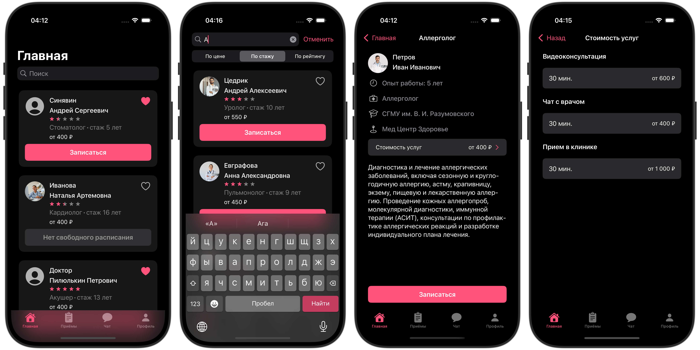

# DocLink


---

## Technologies:
- **Languages**:
  - Swift
  
- **Frameworks**:
  - SwiftUI
  
## Localization

The application is localized for the following languages:

- English 🇺🇸
- Russian 🇷🇺

  ## Installation:
1. Clone the repository:
   ```bash
   git clone https://github.com/AdamMirzakanov/DocLink
   ```
## Screenshots (iPhone 16 Pro Max)



## Contact

- **Email**: adamirzakan@gmail.com
